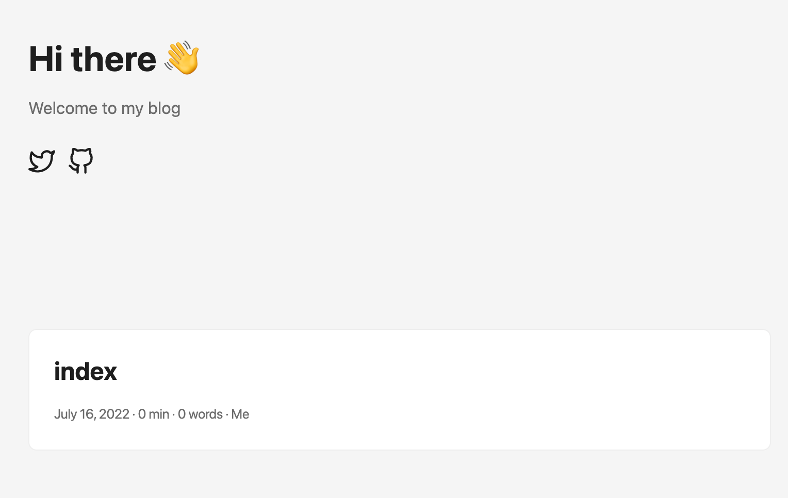

100 番煎じぐらいかもしれませんが、せっかく Hugo x Github Pages でこちらのブログを作ってみたので、一連の作業ログを残しておこうと思います。

## 取り急ぎの補足

- 基本は hugo のクイックスタート参照で OK
  - [https://gohugo.io/getting-started/quick-start/](https://gohugo.io/getting-started/quick-start/)
- 自分が選んだテーマにも同様のクイックスタートがある場合が多いのでそちら参照した方がよい
  - このブログのテーマ:
    - [https://github.com/adityatelange/hugo-PaperMod/wiki/Installation](https://github.com/adityatelange/hugo-PaperMod/wiki/Installation)
- おすすめの hugo テーマまとめてるサイトとかあります
  - 公式: [https://themes.gohugo.io/](https://themes.gohugo.io/)

## Hugo を導入する

では早速ブログ作成してみましょう！

まずは Hugo の導入からです。

```
brew install hugo
```

```
hugo new site サイト名

# 今後選ぶテーマによっては下記のようにyml形式を選んだ方がよい場合もある
# ymlフォーマット選ばない場合はtoml形式になる
# 後でconfigファイルを設定するときに toml か yml のどちらかでサンプルのテンプレートを作っているときがあるので
# 先にテーマを選んだほうが良いです

hugo new site サイト名 -f yml

```

- git init

```
cd サイト名
git init
```

- テーマ指定

```
# テーマによってコマンドは変わります
# 下記はこのブログのテーマのPaperModの場合

git submodule add --depth=1 https://github.com/adityatelange/hugo-PaperMod.git themes/PaperMod
git submodule update --init --recursive
```

- config ファイルを設定

  - 各テーマに config ファイルのサンプルがあるので、既存の `config.yml` or `config.toml` のファイルにコピペして貼り付ける
    - 前述のサイトを作るときに `yml` 形式選んでいない場合は `toml` で作られる
    - PaperMod の場合
      - [https://github.com/adityatelange/hugo-PaperMod/wiki/Installation#sample-configyml](https://github.com/adityatelange/hugo-PaperMod/wiki/Installation#sample-configyml)

- ここまででサイトが確認できるので下記コマンドで確認

```ruby
hugo server

# 上記でサーバーが起動できるので、terminalに表示される下記にアクセス
# Web Server is available at http://localhost:1313/
```

- 下記のような表示ができてれば OK です！


## Github pages の設定

それでは次に Hugo で作ったページを、Github pages を連携して公開出来るようにしましょう！

- config ファイルを github pages にあわせて変更

  - baseURL の変更と publishDir を追加

  ```ruby
  # config.yaml or toml

  # 公開するページのURLを変更
  baseURL: "https://githubアカウント名.github.io/リポジトリ名"
  publishDir: "docs"
  ```

- hugo コマンドで docs 配下にファイルを作成

  ```ruby
  $ hugo

  # 上記で /docs にindex.htmlなどテンプレ用のデータが作成されます
  ```

- 上記までの変更を github に push

### Github 側の設定

- リポジトリを public に変更
  - Settings ⇒ **Danger Zone ⇒ Change repository visibility**
- pages の設定を変更
  - Settings ⇒ Pages ⇒ Source
    - None から master or main のブランチを選択
    - select folder で docs を選択

上記で一連の設定は完了です！

---

pages への反映は 5 分程度かかると思うので、ある程度時間をおいてから、先程 baseURL で設定した URL にアクセスしてみてください！

localhost で確認したのと同じサイトが github pages で確認できたらサイトの公開は完了です！

## ページの追加

上記まででブログの作成は完了しましたので、最後にページの追加方法だけ確認しましょう！

```
$ hugo new posts/ディレクトリ名/index.md

# 例
$ hugo new posts/2022_0716/index.md

```

上記コマンドで、`/content/posts/2022_0716/index.md`が自動で作成されます。

```
# index.mdの中身

---
title: "index"
date: 2022-07-16T22:17:33+09:00
# 下書きにするかどうか
draft: true
---
```

`draft`を`false`にすることで下記のようにブログにも反映がされます。



`title`など`—--`で囲まれている部分の内容は各テーマによって異なりますが、テーマ自体のドキュメンにサンプルの記載があるので（今回選んだ PaperlMod の場合は[こちら](https://github.com/adityatelange/hugo-PaperMod/wiki/Installation#sample-pagemd)）そちらを参照して自分好みのサイトに仕上げてみてください。

お疲れ様でした！上記で一連のブログ作成＆記事追加作業は完了になります！

みなさんもぜひ手軽にブログを作って初めてみてください。

Happy Hacking!

---

### 補足 (ディレクトリ構造に関して)

```
hugo new posts/my-first-post.md
```

Hugo の公式サイトでは上記のコマンドでブログポストを作成するように記載があります。

今回使っている PaperMod でも上記で新規ポストを作成することは可能ですが、記事内に画像を追加する場合は[Paper Mod の公式](https://github.com/adityatelange/hugo-PaperMod/tree/exampleSite/content/posts/papermod/papermod-features)でも同様のように、下記のような構造にしないと記事内で画像が参照できなかったため、こちらの形式にしています。

```
/posts
  /directory
    / image.png
    / index.md
```

---

### 参考にさせて頂いたページ

下記ページ導入時に参考にさせていただきました！ありがとうございました！

- [Hugo と GitHub Pages でブログを公開する](https://open-groove.net/other-tools/hugo-github-pages-blog/)
- [Hugo+Github Pages でプロフィールページを作ってみた](https://zenn.dev/okaponta/articles/c302f58507febc)
- [Hugo + GitHub Pages（独自ドメイン適応）でサイトを作成・公開する](https://qiita.com/ysdyt/items/a581277dd1312a0e83c3)
