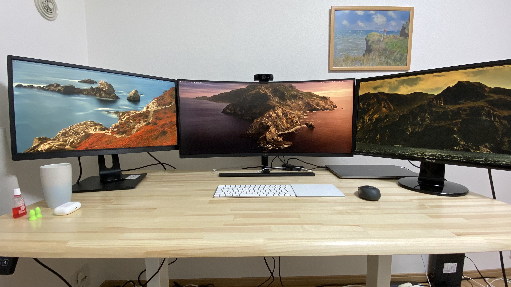
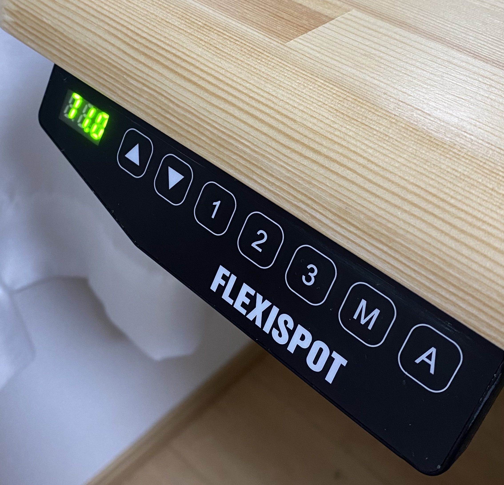
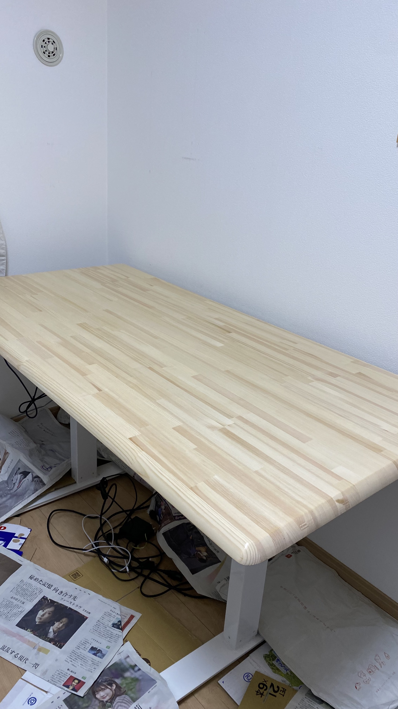
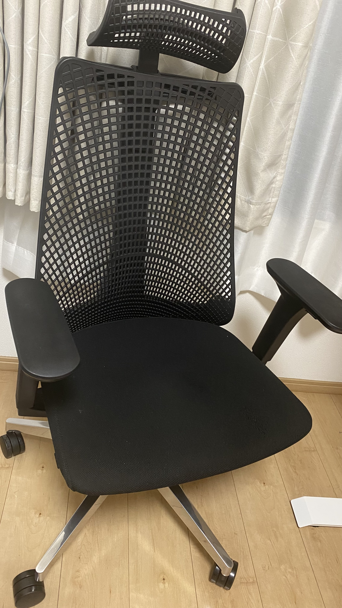
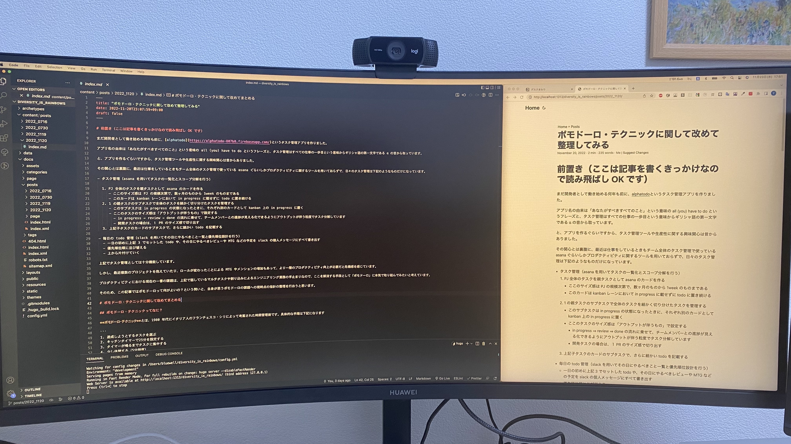
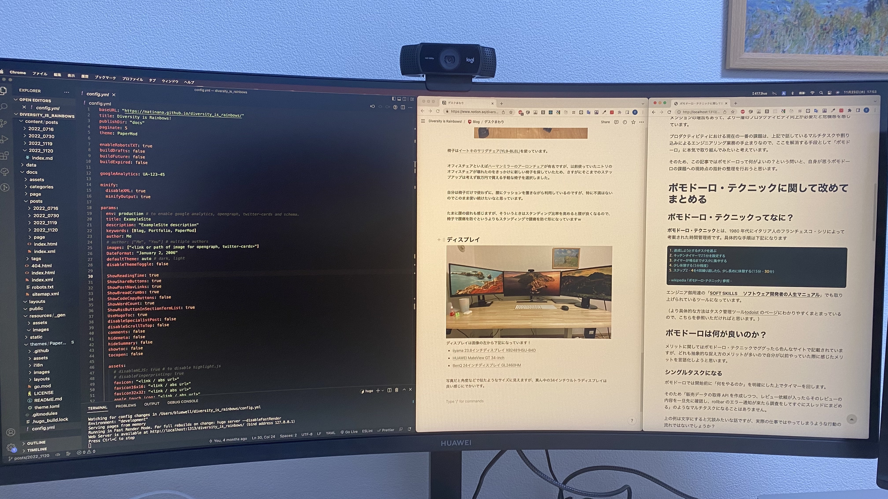
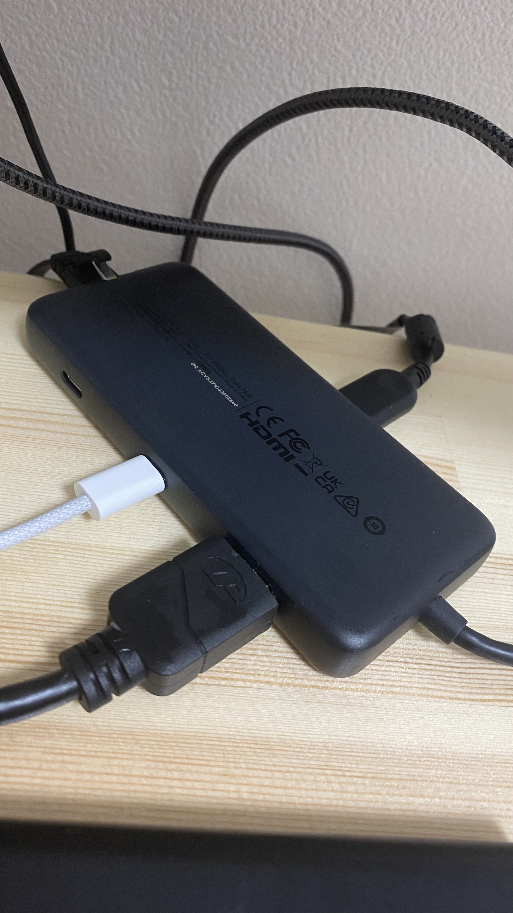
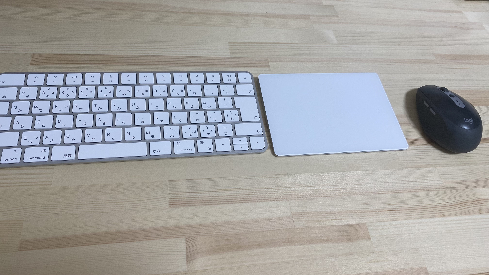
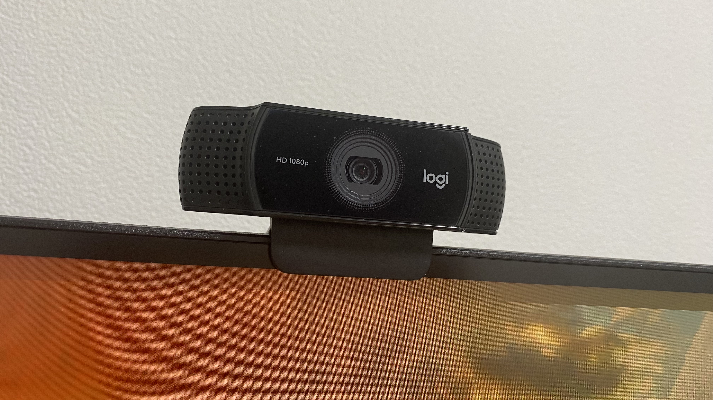

こんにちは matinana です。

今日はエンジニアブログあるあるのデスク周りの記事でも書いてみようと思います。

## 現在のデスク周りの写真

## デスク

デスクの足部分は電動式スタンディングデスクの[FLEXSPOT の EF1](https://www.amazon.co.jp/gp/product/B07LF57DX5/ref=ppx_yo_dt_b_asin_title_o03_s00?ie=UTF8&th=1)を使っています！

画像のようにデスクの高さをボタンひとつで変更可能で、71cm〜121cm の範囲で乗降を行うことができます。

毎回上下のボタンで高さを変えなくても３つまで高さを登録可能なので自分は下記の設定にしています。

1. 普通に座って作業を行う用
2. スタンディングで作業を行う用
3. スタンディング+α で作業を行う用

3 のプラスアルファとはなんぞや…というのは後で話しますねｗ

ボタン一つで上記の高さに変えられるので、「コーヒーを汲みに行くついでにスタンディングの高さに変更しておく」みたいなこともできます。（といっても、数秒で設定した高さに変わるのでコーヒー汲まなくても待ち時間があるわけではありません。）

座って作業し続けて疲れたなってときに、たまに 30 分ぐらい立ちながら作業をすると良い気分転換になるので、個人的には買ってよかったデスクまわりの商品一位だと思っています。（今もスタンディングで記事を書いています^^）

## 天板

(ヤスリがけ＆ニス塗った直後の机)

天板は[ホームセンターのコーナン](https://www.kohnan-eshop.com/shop/default.aspx)で取り扱っている横 150cm、縦 75cm、厚さ 3cm の天板にしています！（オンラインショップには同様のものがなかったので、店鋪だけの扱いの商品かもしれません。）

コーナンでは木材のカットサービスがあるので自分が望むサイズに切り出してもらうこともできるのですが、今回はちょうどよいサイズのものがあったので既製品を選びました！

買ったばかりのときは木材感が強いので、同ホームセンターで紙やすりとニスを購入して仕上げを行っています！

自分で仕上げ作業を行うと愛着が湧くのでもしデスクの足と天板を分けたデスクを使う場合は自作天板はとてもおすすめです！

## 椅子

椅子は[イートキのサリダチェア(**YL9-BLEL**)](https://www.amazon.co.jp/%E3%82%A4%E3%83%88%E3%83%BC%E3%82%AD-%E3%82%AA%E3%83%95%E3%82%A3%E3%82%B9%E3%83%81%E3%82%A7%E3%82%A2-YL9-BLEL-%E3%83%8F%E3%82%A4%E3%83%90%E3%83%83%E3%82%AF-%E3%83%96%E3%83%A9%E3%83%83%E3%82%AF/dp/B07RQSN6QK)を使っています。

オフィスチェアといえば[ハーマンミラーのアーロンチェア](https://www.hermanmiller.com/ja_jp/products/seating/office-chairs/aeron-chairs/)が有名ですが、以前使っていたニトリのオフィスチェアが壊れたのをきっかけに新しい椅子を探していたため、さすがにそこまでのステップアップは考えず数万円で買える手軽な椅子を選択しました。

自分は椅子だけで使わずに、腰にクッションを置きながら利用しているのですが、特に不満はないのでこのまま使い続けたいなと思っています。

たまに腰の疲れも感じますが、そういうときはスタンディング比率を高めると腰が良くなるので、椅子で腰痛を防ぐというよりもスタンディングで腰痛を防ぐ形になっていますｗ

## ディスプレイ

ディスプレイは画像の左から下記になっています！

- [iiyama 23.8 インチディスプレイ XB2481HSU-B4D](https://www.amazon.co.jp/%E3%83%9E%E3%82%A6%E3%82%B9%E3%82%B3%E3%83%B3%E3%83%94%E3%83%A5%E3%83%BC%E3%82%BF%E3%83%BC-23-8%E3%82%A4%E3%83%B3%E3%83%81-XB2481HSU-B4D-DisplayPort-%E6%98%87%E9%99%8D%E3%83%BB%E3%83%94%E3%83%9C%E3%83%83%E3%83%88%E6%A9%9F%E8%83%BD/dp/B08PV27KDK)
- [HUAWEI MateView GT 34-inch](https://consumer.huawei.com/jp/monitors/mateview-gt-se.html)
- [BenQ 24 インチディスプレイ GL2460HM](https://www.amazon.co.jp/BenQ-%E3%83%87%E3%82%A3%E3%82%B9%E3%83%97%E3%83%AC%E3%82%A4-GL2460HM-24%E3%82%A4%E3%83%B3%E3%83%81-DVI%E7%AB%AF%E5%AD%90/dp/B00DCGO2PS)

写真だと角度などで似たようなサイズに見えますが、真ん中の 34 インチウルトラディスプレイは良い感じにでかいです。

上記のように 1 画面の左側でコードを書きながら、右側で画面を確認することが余裕でできます。

上記のように 3 画面ぐらいでもいけるので、コード＋画面＋リファレンス的な形も一画面で完結することができます。

私の場合は基本的には下記のような使い方をしています。

- ウルトラディスプレイは前述の 2 画面の使い方
- 左のディスプレイで開発で見ている画面以外のブラウザ
- 右のディスプレイで slack やポモドーロ関連のツール

一つの画面で切り替えなどを行って作業することも可能ですが、コーディングにマストなものを真ん中のスクリーンに集約することで意識的に左右を見ない限りは余計なものが目に入ってこないという環境にしています。

## アクセサリ関連

### USB ハブ

USB ハブは [Anker PowerExpand 8-in-1](https://www.amazon.co.jp/gp/product/B087TB7YM7/ref=ppx_yo_dt_b_asin_title_o02_s00?ie=UTF8&psc=1)を使っています。

これ一つで USB まわりだけでなく、mac の充電、有線ケーブル、SD もカバーできます。

ディスプレイや外部アクセサリが多いのですが、社用 PC と私用 PC を入れ替える際にもこのケーブルの差し替え＋ α だけで大丈夫なので、切り替えが楽ちんで助かっています。

### キーボード・トラックパッド・マウス

キーボードもトラックパッドも apple 純正の[Magic Keyboard](https://www.apple.com/jp/shop/product/MK2A3J/A/magic-keyboard-%E6%97%A5%E6%9C%AC%E8%AA%9Ejis?fnode=6b21ddcc750b7f24fde72495d5d76ed8db36fffff41c6d29e64dec39fed164b2073031b7d79fb676ac282f7bb29eca7b741a5c0617c97f36a045236f7269fe9ff83f4fb2bc101f54bf052d8cb1f2a79944577d629599ffaf3cf27937460c9a61a8cc1d61b9af6e6ce65341bdc21b8e66)と[Magic Trackpad](https://www.apple.com/jp/shop/product/MK2D3ZA/A/magic-trackpad-%E3%83%9B%E3%83%AF%E3%82%A4%E3%83%88multi-touch%E5%AF%BE%E5%BF%9C)。マウスは[ロジクールの M590GT](https://www.amazon.co.jp/gp/product/B072N792LK/ref=ppx_yo_dt_b_asin_title_o07_s00?ie=UTF8&th=1)です。

あれ？トラックパッドもマウスも使っているの？という疑問があると思いますｗ

その答えはまさに「はい」で、基本的にはキーボード＆マウスの組み合わせですが、パッとした移動や mac 独自の機能を使う際にはトラックパッドが便利だったりするのでこの位置取りで組み合わせて使っています。

最近この組み合わせにしたばかりですが、トラックパッドには[Better Touch Tool](https://folivora.ai/)という神ツールがあるようなので、近いうちに導入してみたいなと思っています。

## その他

### web カメラ

web カメラは[ロジクールの C922n](https://www.amazon.co.jp/%E3%83%AD%E3%82%B8%E3%82%AF%E3%83%BC%E3%83%AB-C922n-%E3%82%B9%E3%83%88%E3%83%AA%E3%83%BC%E3%83%9F%E3%83%B3%E3%82%B0-%E8%87%AA%E5%8B%95%E3%83%95%E3%82%A9%E3%83%BC%E3%82%AB%E3%82%B9-2%E5%B9%B4%E9%96%93%E3%83%A1%E3%83%BC%E3%82%AB%E3%83%BC%E4%BF%9D%E8%A8%BC/dp/B07QNJ2YQD/ref=sr_1_3?__mk_ja_JP=%E3%82%AB%E3%82%BF%E3%82%AB%E3%83%8A&crid=2RM91JGL89393&keywords=c922n&qid=1669195379&qu=eyJxc2MiOiIxLjY2IiwicXNhIjoiMC45NyIsInFzcCI6IjAuNzIifQ%3D%3D&s=electronics&sprefix=c92%2Celectronics%2C175&sr=1-3)を使っています。

普通に使うと上から見下ろす形になってしまうので、採用面接の際には候補者の方と目線を合わすためにウルトラワイドディスプレイの高さを一番下に下げて、カメラの角度もなるべく正面になるような形に調整して使っています。

上記の作業がめんどすぎるのでなにか良い代替オプションないのかな？と探し続けていますｗ

### 真空断熱タンブラー

最初のデスク全体の写真にも写っていますが、日々コーヒー飲んだりするときは、[THERMOS の真空断熱タンブラー](https://www.thermos.jp/product/detail/jdm-340.html?color=BL-G)を使っています。

夏は冷たいまま、夏は温かいままの飲み物が飲めるのでおすすめです。

### 耳栓

最初の写真の左端にタンブラーや airpods と一緒に写ってる緑色の小さな文体。

これは[モルデックスという会社の meteo という耳栓](https://www.amazon.co.jp/gp/product/B00ZPH2FWY/ref=ppx_yo_dt_b_asin_title_o04_s00?ie=UTF8&psc=1)です。

複数セットで売っていて、一セット 60 円ぐらいの安価で買えるのですが、遮音性も高く衛生的でもあるので定期的に購入しています。

「airpods × 雨の音」の組み合わせも大好きなのですが、airpods の電池が一日持たないので耳栓も良いですよね。（といいつつ、基本的には何もつけずに仕事しています。笑）

---

以上、デスク周りまとめてみました。

数年後に読み直したら全然違うセッティングになってそうですよねｗ（少なくとも配線まわりはどうにかしたい）

みなさんもぜひ快適な環境を整えて、明日も Happy Hacking!

---

> 3 のプラスアルファとはなんぞや…というのは後で話しますねｗ

デスクの項目で話してた上記の話忘れてたのでまた今度記事にしますね…ｗ
