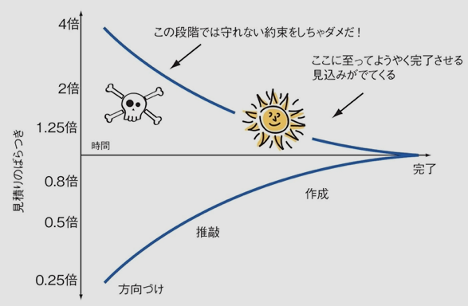

最近チーム内で締め切りがギリギリになったり、スケジュール超過が発生するプロジェクトが連続で発生していました。

現在のチームではスケジュール見積もりフローが確立されてなく、ユーザーストーリーをもとに PdM が大まかなスケジュールを引いて、アサインされたエンジニアが PdM のスケジュールにプラスマイナス（大概にしてプラスになりますが…）でスケジュールを決めるという属人化されたスケジューリングを行っています。

もちろん、それが必ずしも悪ではなく、良い点もあるのですが、結果として特に長めのタスクで前述のような問題が頻発していました。

その解決策の一つとして、見積もり手法である「プランニングポーカー」をチームでやってみたら気づきが多かったので記事で共有させて貰えればと思います！

# プランニングポーカーとは？

プランニングポーカーはプロジェクト開発における期間をチームで見積もりする手法の一つになります。

具体的なやり方はググって貰えればと思いますが、一言でいうと下記のような見積もり手法です。

```
1. ユーザーストーリー(開発タスク)を読み上げる
2. チームメンバーが各々でそのストーリーに対する見積もりを表明する
3. 各々の出した見積もりに関して「なぜその数値にしたか？」の議論を行う
4. 3で出た議論をもとに再度見積もりを行う

(4の結果がチームの合意になるまで繰り返す)
```

なぜわざわざこのような手法を行う必要があるのか？

それは、プロダクト開発における見積もりが困難だからです。

プロダクト開発における見積もりでは下記の「不確実性コーン」という図でも示されるように、最大４倍のスケジュールのズレが発生すると言われています。



不確実性コーン (引用: [アジャイルサムライ 達人開発者への道](https://www.amazon.co.jp/%E3%82%A2%E3%82%B8%E3%83%A3%E3%82%A4%E3%83%AB%E3%82%B5%E3%83%A0%E3%83%A9%E3%82%A4%E2%80%95%E2%80%95%E9%81%94%E4%BA%BA%E9%96%8B%E7%99%BA%E8%80%85%E3%81%B8%E3%81%AE%E9%81%93-%EF%BC%AA%EF%BD%8F%EF%BD%8E%EF%BD%81%EF%BD%94%EF%BD%88%EF%BD%81%EF%BD%8E%EF%BC%B2%EF%BD%81%EF%BD%93%EF%BD%8D%EF%BD%95%EF%BD%93%EF%BD%93%EF%BD%8F%EF%BD%8E-ebook/dp/B00J1XKB6K))

---

このように見積もりは難しいという前提があるため、見積もりの目的は「正確な開発期間を定めること」ではなく「このプロジェクトはやり遂げられそうなのか？」を判断することに価値があります。

プランニングポーカーは、チームメンバーでの議論・対話を主軸においた手法であるため、

- 複数人の知見によって考慮漏れを防いでより詳細なタスク把握ができる
- 他プロジェクトへの影響度やスコープの切り分けに対する共通認識の把握ができる

上記メリットをもとに「このプロジェクトをやり遂げられそうなのか？」という問いに対して複合的な判断を行う事ができるようになります。

前フリとしてプランニングポーカーや見積もりに関して触れてみましたが、これらは多くの記事で語られているので、今回は実際にやってみた気づきをピックアップして共有します！

# 気づき

## タスクには人によって「見えているタスク」と「見えていないタスク」が存在しており、それを認知することが正しい見積もりに寄与する


今回は「Ruby アップデート」を題材にプランニングポーカーを行ってみました。

みなさんは「Ruby アップデート」と聞いてどんなタスクが頭に思い浮かびますか？

- Ruby のバージョンをアップデートする
- 上記アップデート後の動作確認

上記の二つのタスクでしょうか？

ではこの二つの見積もりをやりますね！

### はいストップ！！！

確かに上記で Ruby のアップデート自体はできるかもしれません。

しかし、多くの場合上記だけでは Ruby アップデートで得たかった結果は得ることができないと思います。

Ruby のアップデートに伴って廃止予定になる機能の Deprecated Warning も潰しておかないと、適切に使えない機能が生まれます。

また、関連する gem のアップデートも必要になりますし、CircleCI で CI/CD を実現している場合は CI のベースイメージの更新も必要になります。

このように、一言に「Ruby アップデート」と括っても、細かく切り分けるとその中には色んなタスクが含まれていることがわかります。

勿論、プランニングポーカーを行う際に上記を把握していなくても、見積もりはできますし、開発も進められます。

しかし、これでは適切な見積もりは出来ません。上記を認識していないということは、上記が見積りの期間に入っていないということです。この場合、設定されるスケジュールが恐ろしい結果に繋がるのは明白ですよね。

プランニングポーカーでは、複数のメンバーで対話を行いながら見積もりを進めるため、その開発に必要な「見えているタスクと見ていないタスク」をチームの知見で洗い出す事ができます。

## タスクの完了定義をチームで揃えることが正しい見積もりに寄与する


先程は見えているタスクと見えていないタスクに関して触れましたが、見えているタスクにも「完了をどこにするか？」というスコープの概念があります。

たとえば先程の「Deprecated Warning を潰す」というタスクにおいては、

- Warning を完全に潰す
- Warning は残っても良いが、テストが一通り動くところまでは潰す

上記のような選択肢がありますし、

「関連 gem のアップデート」に関しては

- すべて最新のバージョンにアップデートする
- 上げる ruby のバージョンで最低限使えるバージョンまでアップデートする

上記のような選択肢があります。

あらゆる開発プロセスにおいて「スコープ」というものは最も意識すべきことの一つだと考えていますが、それは見積もりにおいても同じです。ここの認識をチームで揃えないと、見積もり結果が変わってくるため、タスクの完了条件を揃えるということはとても大切な観点になります。

## プランニングポーカーの効果を最大限感じるためには抽象度の高いタスクを対象にした方が良い


今回は「まずはプランニングポーカーをやってみよう！」というきっかけでプランニングポーカーを行ったのですが、その題材として前述のように「Ruby アップデート」を選択することにしました。

より具体的な機能開発の方が「やるべきことが明確で見積もりがしやすそう」と思っていましたが、実際に ruby アップデートを題材にやってみて、抽象度の高いタスクだからこそ価値が最大化されると感じました。

前項の二つで見てきたように、抽象度が高いからこそ「見えていないタスク」や「完了の定義が曖昧なタスク」が出てきます。

プランニングポーカーはチームで対話を通して不確実性を減らせるように見積もりを行うことが一番の特徴ですので、「やるべきことが明確で完了の定義も一つしかないタスク」では不確実性が大きくなくプランニングポーカーの価値も感じにくくなってしまいます。

勿論、具体的なタスクだとしても、他 PJ との影響範囲や、既存実装のハマりポイントなど、該当機能の開発者個人では見えていない不確実性はあり、チームメンバーが集まることでより知見を集約した見積もりが可能になります。ですが、前述したように、正確な期間を見積もることがプランニングポーカーの目的ではありません。

対話を通してユーザーストーリーの理解や不明点の洗い出しを行い、完了の定義や対応するべきタスクの共通認識をチームで築く。それらのチームの知見や共通認識があるからこそ不確実性を減らせ「それならばこれぐらいの期間でやり遂げられるよね」という合意を持てること。これがプランニングポーカーの目的になります。

そのため、少なくともプランニングポーカーを初めてチームでやってみる際は、抽象度の高いタスクをもとにやってみるのがオススメです！

## プランニングポーカーは面白い

不確実性の高いタスクに対して「私はこれぐらいの見積もりだと思います！」と意思表明するのは、最初はちょっと緊張します。

自分だけ他の人と違う見積もりになっちゃったときの「お…！（ゴクリ…）」という気持ちは何度やっても慣れないと思います。笑

でも、実際にやってみると面白いです。

見積もりが異なる人を非難するのではなく、対話でそのギャップを埋めていくため、他の人の考えを知れ、自分の思考の整理にもなります。

「なるほど〜その観点漏れてたなぁ〜」とか、「お！その懸念に対してはこういう理由で払拭できると思いますよ！」と、普段一人で整理していることを他の人と対話しながら整理できるのはブレストやディベートと同じような創造的な体験だと感じます。

私自身、まだ２回しかプランニングポーカーをやっていませんが、今後は 1 人月ぐらいかかりそうな PJ に関しては積極的に取り入れて行こうと思っているので、またぜひ学びを共有させてください！

---

以上、プランニングポーカーの学びを書いてみました。

みなさんもぜひやってみてくださいね！

Happy Hacking!

---

(謝辞) 記事中のイラストはすべて[ソコスト様](https://soco-st.com/) からお借りしています。素敵なイラストありがとうございました 🙏
