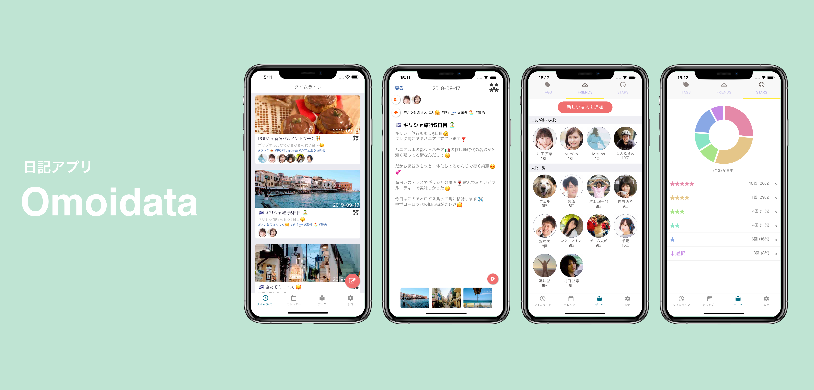
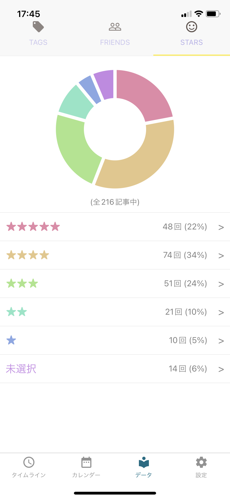

自分で 3 年ほど前に作った日記アプリの[Omoidata](https://apps.apple.com/jp/app/omoidata-%E6%97%A5%E8%A8%98/id1467571569)に投稿した日記の数が気づいたら 200 記事を超えていた。ちょっと感慨深くなったので、言葉に残しておこうと思います。

---

Omoidata は「思い出 x データ」を名前の由来としているように、思い出を様々な要素と共に記録し、それをデータとして客観視することで未来をよりよく築いていく気づきを得られることを目的にした日記アプリです。

日記というコンテンツは思い出を記録し、振り返ることを目的に使われることが一般的ですが、振り返るための機能としては「タグ」や「カレンダー」など、数少ない機能に限定されていて十分だとは言えません。

そこで Omoidata では、残したい思い出に含まれるであろう友人や有名人などの「人物」をタグのように登録する機能、そのときに感じた感情を段階に分けて振り返られる「気持ち機能」など、自身の思い出をよりデータ化して記録できる機能を備えています。

---

上記のような思いを込めて作ったアプリで、実際にリリースして 3 年程度たった今あらためて振り返ってみると、アプリ上で全 216 記事を書いていることがわかりました。

単純計算すると 365\*3 /216 で 5.069…なので、5 日に一回程度日記を書いていることになります。

個人的な指標としては ★4 つ以上はハッピーなときにつけているので、★5 とあわせて日記をつけた 6 割弱の日付がハッピーということになります。

「幸せな 3 年間だったんだよな〜」と言えそうですが、日記に残しておきたい日ってハッピーな日が多いのは当然なので、そこの正しい数値をすくい上げる仕組みをそろそろ追加しないとな〜という反省もあります。

むしろ興味深いのは「未選択」としている日付の日記。

> 今日は星は未設定。いつかこれが星五つだよと言えるように頑張ろう！

上記は未選択の日記の一つに書かれている言葉です。

このような「星を設定するのが面倒なので取り急ぎ設定しない」ではなく、「（今日の選択の結果を決めるのは将来の自分であるとして）意図して星の選択をしない」という使い方をしています。

これは作った当時は想定をしていないような使い方だったので、開発者自身の自分がその使い方をしているのはとても面白い体験だと思いました。

---

個人アプリ制作。

自身でも何個かアプリを作ってきました。その多くが自分のペインを解消するためのアプリでした。

でも改めて、作ったアプリの中で長期的に使っているのが Omoidata だけであることを考えると、誰かの、少なくとも自分の「本気の課題」を解決するためのアプリが良いよなぁと思います。

自分は 17 歳からずーっと継続的に日記を書き続けていて、Omoidata を作る前は[マイブック](https://www.amazon.co.jp/%E3%83%9E%E3%82%A4%E3%83%96%E3%83%83%E3%82%AF-%E6%96%B0%E6%BD%AE%E6%96%87%E5%BA%AB-%E5%A4%A7%E8%B2%AB-%E5%8D%93%E4%B9%9F/dp/4101208743)というその年ごとの表紙があるだけの白紙が 365 ページ続く文庫本タイプの日記を毎年使っていたんですよね。

でも過去の日記を振り返りたいときに検索性がめちゃくちゃ低いし、ふとしたときに振り返るのもわざわざ本を取り出して読まないといけないので大変でした。

日記だからといって毎日書くわけではないので、空白のページが続いちゃうのも切なかったですしね…笑

10 年以上日記を使い続けているからこそ上の課題は自分にとって大きな問題だったし、日記が与えてくれる恩恵も分かっていたので Omoidata を作りきることができて、今でも使い続けているのだと思います。

---

作って 3 年以上が経ち、エンジニアリングの知識もプロダクト開発の経験も高まりました。

使って 3 年以上が経ち、このプロダクトの課題も、あると良い機能も随分と知見が増えました。

最近はめっきりアプリ開発に時間を使えていませんでしたが、少しずつ再開していこうと思います。ぜひこの場でもまた Omoidata の話をさせてください。

思い出は活力になり、記録は指針になる。

この想いを大切に、がんばります！

Happy Hacking!
