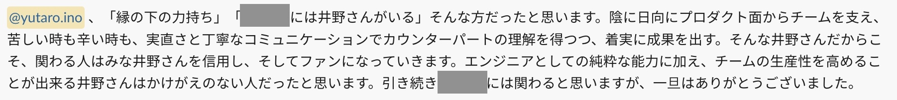
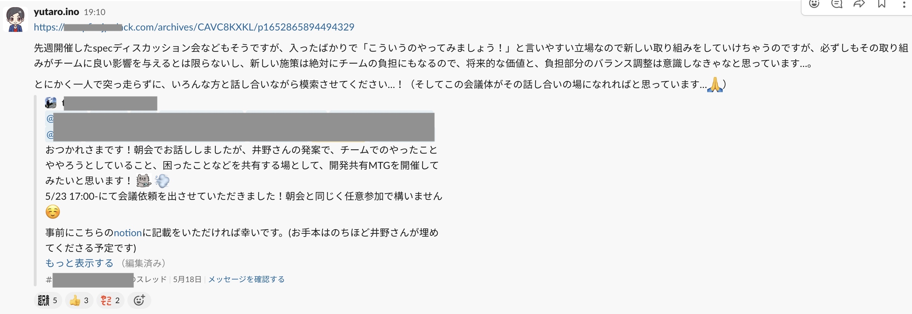
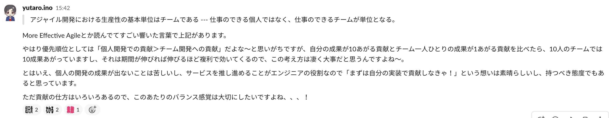
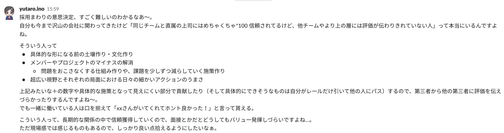
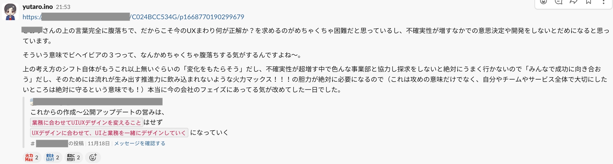
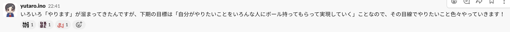
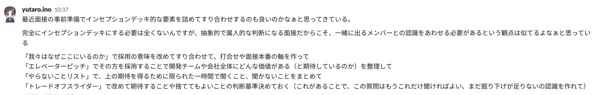
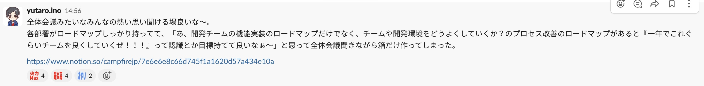

こんにちは matinana です。

あっというまに今年も残り２日になってしまったので、今年の仕事の振り返りを行おうと思います。

# 1 月

エンジニア２名、週 2.5 日稼働の業務委託 1 名の計 3 人のエンジニアチームに 2 月から新メンバーが来ることになり、オンボーディングやドキュメントの整理を行っていた一月でした。

サービス自体は 2019 年から始まっていて、社外へのアウトソースをはじめ色んなエンジニアが入れ替わりになって作ってきた大きなサービスですが、結果として暗黙知の多いサービスになっていたためオンボーディングドキュメントや体制を整える必要性に駆られていました。

詳しくは[こちらの記事](https://matinana.github.io/diversity_is_rainbows/posts/2021_1212/)にまとめていますが、オンボーディングを行うことで下記の発見が得られたことは大きな糧になりました。

> 書いてみて思うことはこれらは「新メンバーのため」ではなく、「チームのため・プロダクトのため」のドキュメントであり、まさしく自分のためになるドキュメントだと感じたということです。

# 2 月

関わっていたサービスが自社としてはサービス終了することになりました。

こちらのクローズからその後の引き継ぎに関しては、[つい最近記事にしたばかり](https://matinana.github.io/diversity_is_rainbows/posts/2022_1220/)なので割愛します。

全社としての選択の集中の結果になりますが、サービスの業績も少しずつ良い方向に向いていて、新メンバーも迎えたばかりで、まさにこれからというフェイズだったのでチームの精神的にも、個人の負担としてもハードな一ヶ月だったと記憶しています。

# 3 月

2 月にサービスクローズが決まりましたが、自社として 2 年近く運用が必要な状況でしたので、エンジニアコストや運用コストがかからなくなるような仕組み作り・実装を行っていました。

詳しくは 2 月の項目に記載の記事を読んで頂ければと思いますが、限られた時間の中で優先順位を整理して、変動する複雑な内部環境の中で意思決定を行っていく業務はとても良い経験になりました。

終了するサービスにはリードエンジニアとして関わってきましたが、自身としても 4 月からは別サービスにジョインする想定だったので、月末までに運用が 2 年無事に務められるだけの対応を完了しなければならずでした。

これらが無事に終わって「やりきった！」というときに、プロジェクトオーナーからかけて頂けた言葉は今でも大切にしています。

# 4 月

今も関わっている社内の新しいサービスに関わりはじめたのが 4 月からでした。

「お疲れ様」の意味も込めて一週間有給を頂いていたのですが、「別サービスでリードエンジニアだった自分が、成果出すまでに時間をかけるのはかっこ悪いよな…」と思って、その一週間で新しく関わるサービスのキャッチアップをしていました。笑

元ユニコーン企業で PdM をしていた前サービスの PdM が、新サービスジョイン時にやるべきことは？という問いに「兎に角色んなものの匂いを嗅ぎまわる」と言っていたこともあり、業務から離れてサービス全体像を嗅ぎ回っていました。

業務を始めるとこういった時間は中々取れなくなるので、この一週間はとても貴重だったと今振り返っても想います。

# 5 月

入って一月経ち、チーム全体で話す文化や実装の指針がもう少しあった方が良いと動き回った一ヶ月でした。

開発共有 MTG という隔週で個々人の課題やチームの改善ポイントを話す場を作ったのと、spec ディスカッション会というテストコードに関してチームで話す場を作ったりしていました。

どんなに素晴らしい施策だとしても、チームへの導入プロセスやコミュニケーションを疎かにすると成果は伴ってこないため、ここは凄く気をつけながら進めていた気がします。

# 6 月

個々人のチームへの貢献をどう増やすか？みたいなことを考えていた一ヶ月でした。

また同時にチームへの貢献を引き出すためにも、個々人の負担や属人化をどう減らせるかを考えたりもしていました。

やったこととしては、5 月の spec ディスカッション会を経て、チームにテストコードの指針を作るため、[スタイルガイド](https://github.com/willnet/rspec-style-guide)の輪読会など行っていました。

テストコード関連の話は[この過去記事](https://matinana.github.io/diversity_is_rainbows/posts/2022_0730/)にスライドをまとめています。

あとは開発共有 MTG や普段の朝会などで意見をより吸い上げしやすくするためにゲーム大会（ボンバーマン大会）なども企画して、チームのコミュニケーション活性化を狙ったりしてました。

部署を飛び越えて参加してくださる方や、メンバーの家族が参加してくれたりと結果として大成功だったと思っています。

# 7 月

エンジニア採用には前サービスからも関わっていたのですが、この頃から現サービスの採用にも結構関わっていました。

エンジニアサイドの評価が高かったエンジニアが、経営層の評価が芳しくないケースが連続したこともあり、どんな人を取るのか、どんな点を見るのか、そのあたりの認識合わせとして経営層とエンジニアメンバーで一人ひとりの指針を話す会を設けられたのはとても良い経験になりました。

採用は難しい意思決定が多いですが、下記の気持ちはずっと大切にしたいと考えています。

あとは、「プロダクト定例」と銘打って PdM、エンジニア、デザイナー間での週一コミュニケーションの場を作る動きにも加わっていました。

現在はきっちり目に分かれている各チーム間の中で、お互いのチームや別 PJ への関心を強めていくための土壌づくりを目的にした定例です。

毎週の定例で「多種多様なコミュニケーションの中にこそ、その組織の本質が反映される」というのを改めて感じ、自社の強みは多様性であると考えているので、より一層プロダクトチームの連携を強めていこうと決めた月になりました。

# 8 月

12 月現在も続いている社内の様々な部署が関わる巨大 PJ が始まった月でした。

いくつかのフェイズに分けて進めていく PJ ですが、その最初の土台になるような機能開発です。

巨大 PJ の一端ということあり、その先を見据えた運用変更も仕様に含める必要があるため、普段デザイナーの方が進めてくれているユーザーインタビューにも参加させていただき、目の前の機能開発だけでなく、ユーザー体験としてどうしていくべきなのか？を徹底して考える日々が始まりました。

また、3 末でサービスの新規開発を終了し運用だけを行っていた前サービスが MBO を果たしたのも 8 月でした。

2 年以上関わっていたサービスが終了せずに違う形でも続くということはとても誇らしいことであり、とても幸せだと感じた瞬間になりました。

# 9 月

8 月に始まった巨大 PJ と共に、8 月に決まった MBO によるサービス再開実装を引き継ぎの一貫で行っていました。

また、200 件近いコミットが積まれている数ヶ月続いた実装 PR のレビューも担当することになりました。

このレビューは仕様書なども適切にまとまっておらず、PdM と開発エンジニアの中の共通認識も確率出来ていないなかでレビューに入ったため、レビュアーというよりも PM 的な立ち位置で開発仕様や進め方の調整をすることに。

手持ちタスクがどれも期限カツカツな中での想定していないレビューの重さだったので苦しい毎日でしたが、結果として PJ 終了後の KPT で「井野さんがいなければ年内は終わらなかったかもしれない」という声も聞けたので、頑張って良かったなと思っています。笑

# 10 月

8 月から始まった巨大 PJ のメイン機能の仕様策定が始まりました。

「業務にあわせて UI/UX デザインを変えるのではなく、UX デザインにあわせて UI と業務を一緒にデザインしていく」という一番面白いフェイズかつ一番苦しいフェイズの機能開発です。

9 月に自社の 10 個のバリューが 3 つのビヘイビアに変わったばかりだったのですが、今のプロダクト作りとビヘイビアがマッチすることに腹落ちしたのも 10 月でした。

9 月にレビューで入った納期が伸び伸びのタスクなど含めて、個々人で見積もりを行うのに限界を感じていたため、プランニングポーカーをやってみたりと、PJ の進め方を少しずつ改良していく動きが見え始めた一月でもありました。

また個人の動き方としても今のチームに入って半年が過ぎ、自分が主体となってチームを改善していくのではなく、チームの個々人がより活躍出来る仕組みへと態度や時間の使い方を変えていったのもこのあたりになります。

具体的には前述の巨大すぎる PR をはじめとした、自社開発における多くの PJ のスコープの大きさへの懸念から、スコープ分割に関するワークショップを他のエンジニアメンバーにハンドルを握って頂く形で進めるなどしていました。

# 11 月

引き続き巨大 PJ の UX 体験や開発仕様を詰め続けていました。

その他の取り組みとしては、自分が育休で一時的に離れることもあり、今まで採用に関わっていなかったメンバーが採用に関わることになったため、採用の指針や共通認識作りを行ったりしていました。

これに関してはまだ指針の叩きをチームに共有しただけで、実際の運用はまだ始められていないのですが、来年の課題にしたいと考えています。

また以前関わっていたサービスのリニューアル対応を 11 月末に控えていたため、そちらにも最終的な引き継ぎとして関わっていました。

無事リニューアルを終え、二年半ほど関わっていたサービスとの別れがあった月にもなります。

# 12 月

11 月よりエンジニアチームを 3 つのドメインに分けていたのですが、その一つのドメインのリードエンジニアに就任しました。

また、忘年会で自社のバリューに沿った人を MVP として表彰する場で会社の標語になっているバリューで MVP を頂くこともできました。

その他にも、突発的に生まれた社長起因 PJ のキックオフ MTG にエンジニアサイドの調整役として参加したり、社内の全体会議に刺激を受けてエンジニア改善ロードマップを作成したりと来年に繋がる種も撒けた一月だったと思います。

---

この一年、振り返ってみると本当にいろいろなことがあった一年でした。

「楽しかったか？」と問われると、「辛かった」というのが本音の毎日でしたが、「プロダクトとチームのことを考え切ることができたか？」と問われたら「はい！」と自身を持って答えられるそんな一年を過ごすことが出来たと思っています。

来年もがんばります。

今年も一年ありがとうございました。

Happy Hacking!
