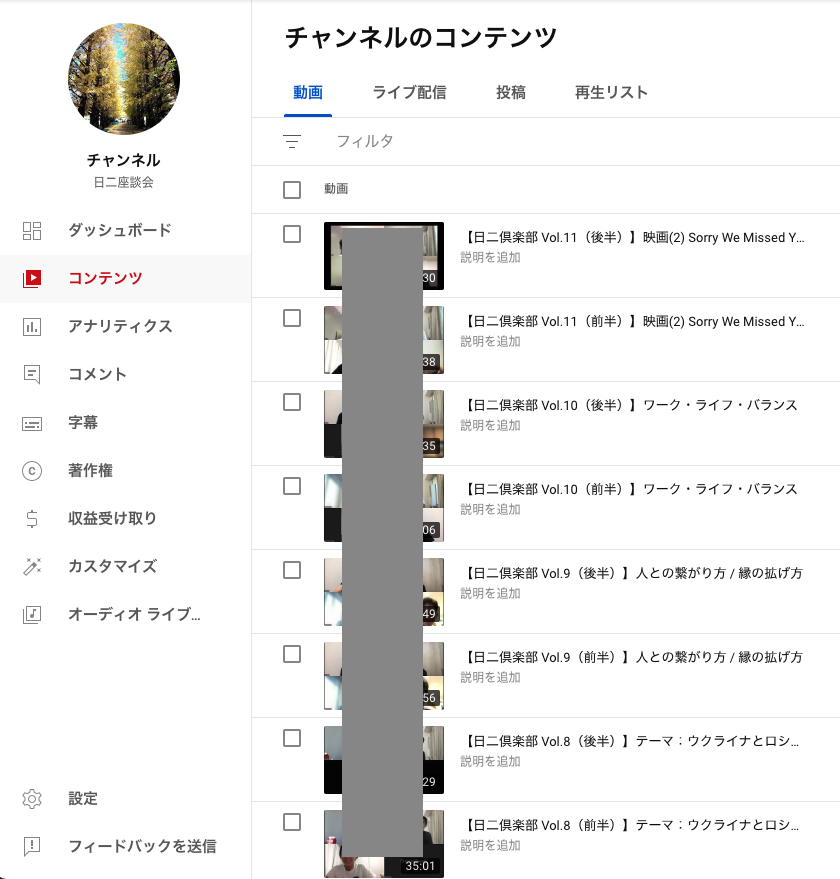

昨日は[2022 年の仕事の振り返り](https://matinana.github.io/diversity_is_rainbows/posts/2022_1230/)を行っていましたが、本日は 2023 年にやりたいことを整理しておきます。振り返りでは仕事のことだけを書きましたが、折角なのでプライベート含めて書いてみます。

# (仕事) リードエンジニアとしての能力を高める

仕事の目標としては「素晴らしいプロダクトを作ること」の一言ですが、自身の責務であるリードエンジニアとしての能力を高めることがそれに繋がると考えています。

能力と一言に言っても、[以前記事に書いた](https://matinana.github.io/diversity_is_rainbows/posts/2021_0630_2/)ようにリードの役割は会社ごとに異なりますし、また会社のフェイズや個人の資質によっても行うべきアクションは異なります。

その上で、現在の自身の興味とチームの課題に沿ったものを「設計、マネジメント、事業理解」を軸に高めていきたいと考えています。

## 1. 設計

### 設計、コーディング、レビューなど各実装フェイズにおける仕組み・指針の整備

これらのプロセスでは統一された仕組みや指針がなく属人化している部分が多く、短期的にも長期的にも開発チームのパフォーマンスに悪影響があります。

今季、よりチームがスケールしていく中でも、仕組みや指針があることで、チームの生産性向上に寄与出来ると考えているので、ここに注力して挑戦していきたいです。

### サービス内の技術やドメイン技術に関する広範知識の向上

インフラ含め、サービスで使われている開発技術や、決済等のドメイン独自の技術など、まだまだ明るくない部分も多いため、チーム内で議論出来るだけのベースをしっかり築きたいと考えています。

## 2. マネジメント

### (対チーム)

### 開発プロセス・チーム改善ロードマップを元に、各メンバーが興味関心で活躍し、チームを改善できる仕組みづくり

[前回の記事](https://matinana.github.io/diversity_is_rainbows/posts/2022_1230/)でも軽く触れましたが、事業のロードマップではなく、開発プロセスやチーム改善のロードマップを作成し、見える化しようと考えているため、ここをしっかり突き詰めていく。

### MTG 改革

[リモートワークファシリテーションのまなび](https://matinana.github.io/diversity_is_rainbows/posts/2022_1119/)でも書きましたが、現状の MTG には課題感も多く、またチームのフェイズとしても、各々が MTG に責務を持つタイミングになってきたと考えているので、チームで MTG のファシリテーションが出来るような仕組みを作っていく。

### (対 PJ)

### 見積もり・スコープ、優先度の設計

プランニングポーカーやインセプションデッキなど、アジャイルのツールを少しずつ PJ に導入し始めた 2022 年なので、2023 年は全社の PJ に浸透させ、ツールから得られる一つ一つの体験の質も高めていく。

### 開発仕様の見える化・簡素化

複雑な仕様の見える化が出来ておらず、QA やレビューや PJ 後のリファクタリングなどで実装者以外のエンジニアが関わる際に仕様把握がネックになっている課題があるので、ここをもっとクリアにできるような仕組みや構造化を行う。

## 3. 事業理解

### 事業ドメインの解像度上げる

> 業務にあわせて UI/UX デザインを変えるのではなく、UX デザインにあわせて UI と業務を一緒にデザインしていく

前回の記事でも上記書いたように、まさにプロダクトのフェイズが変わって、シンプルな機能開発ではなく、プロダクトの本質を突き詰めた開発が必要になってきたので、そのためにも事業ドメインの解像度を上げる。

### 事業部とエンジニアチームの連携強めていく

事業ドメインの解像度をあげるためにも必要ですし、また機能を実際に適切な運用に落としていくためにも事業部との繋がりはより蜜にしていく必要があるため、ここの連携が出来るように動く。

---

# (個人開発) 個人開発のアプリやっていく！

仕事以外の個人開発に関しては下記二つを挑戦したいと思っています！

## Omoidata の機能更新

[自作アプリを 3 年間使い続けてみて](https://matinana.github.io/diversity_is_rainbows/posts/2022_11_26/)の記事でも書いた日記アプリ。

利用を続けていく中でアプリの課題も多く見つかっていますし、また React Native という業務で触っていない部分の知識向上・更新にも繋がるため、下記の機能実装は行いたいと考えています。

- 古くなった各種ライブラリの更新
- 日記のリマインド機能
- より日記に登録がしやすくなるようなタグや人物のグルーピング
- タグや人物などからクロス集計が出来るようなデータ分析機能の拡充

## 新規ゲームアプリ作り

先月はじめての子供が生まれたのですが、ちょっと先の将来として子供の夏休みの宿題などで一緒にアプリ開発が出来ればと考えています。（笑）

自身としても小学生の頃はゲームプログラマーになりたいと考えていたこともあり、少しずつですがゲームアプリづくりに挑戦したいとも思っています。

「毎年一つ新しいアプリを作る」という経験も素晴らしいものに違いないので、その意味でも何か一つゲームアプリを作ってみようと考えています。

---

# (個人活動) 中高コミュニティ向けのコンテンツを継続的に届ける

プロダクト開発以外の取り組みとしては、ずーっと自身の興味関心の一つである中高コミュニティの活性化を引き続きトライしたいと考えています。

## 座談会コンテンツ

私は中高の学年全体の同窓会の幹事などを行っているのですが、将来的にもっとこのコミュニティを活性化出来たらと考えています。

そのための土壌づくりの一つとして一昨年から月に一度ぐらいのペースで一時間の座談会企画を行っています。

内容は「ワークライフバランス」や「ウクライナ問題」といった具体的なものから「家族」・「可能性」といった抽象的なものまでを幅広く取り扱って、一時間話し合うコンテンツになっています。

色んな仕事を行っている同級生とともに多種多様な話題に対する座談会ができることは本当に学びが多いので、今年も引き続きこの活動を継続していきたいと思っています。

## 音声インタビューコンテンツ

コロナになる前は、同級生の人生に関して話してもらう一時間の音声インタビューコンテンツを行っていました。

幼少期から、現在の仕事、将来やりたいことまで一時間話して貰うコンテンツですが、有名人の話ではなく、自身と同じ高校で学んだ友人や知人のリアルな話を聞くことで「勇気が貰えた」「自分も頑張ろうと思えた」という声を頂ける個人的にもすごい良いコンテンツだと思っています。

現在累計で 19 人ほど行ってきましたが、学年は 400 人以上いるので（笑）今年こそ再開したいと思っています。

## 学年全体の同窓会

コロナ次第ですが…夏ぐらいまでに落ち着けば年末ぐらいに学年全体の同窓会をやりたいなと考えています！

---

以上、プライベート含めて 2023 年にやりたいことを書いてみました。

2023 年の振り返りでそれぞれのやりたいことに対してどれくらい達成できたのかをまた振り返りしますね…！

2023 年も素敵な一年にしましょう。

それではよいお年を！！！
